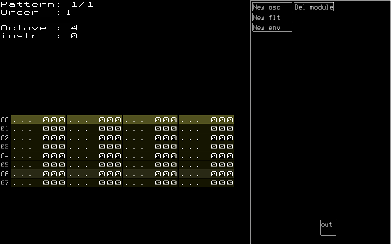

Ghostsyn, a small modular audio synthesizer
===========================================

.. _Dnload: https://github.com/faemiyah/dnload

Ghostsyn is an audio synthesizer written primarily for creating soundtracks
for 4k intros. Its audio generating parts are written in ia32 assembly, optimizing
for small code size and compressibility. A tracker-like UI for composing songs
is included, written in C++17. It's designed to be used together with `Dnload`_,
and should currently work on FreeBSD and Linux.

Disclaimer
----------

This is not the most featureful, polished or easy to use tool for this purpose.
Several rough edges and missing features remain, and creating a finished song
may require tweaking the assembly sources. Keep volume at moderate level, as
there are few safeguards and sanity checks for synth parameters, making it
possible to inadvertently create very loud and unpleasant sounds. Knowledge of
subtractive synthesis fundamentals is mandatory.

Song data format is not currently stable.

If you're looking for more polished tools, there are several available, and some
even provide a VST plugin for composing songs in a full-fledged DAW environment.
Some that are known to produce great results in capable hands:

.. _4klang: http://4klang.untergrund.net/
.. _Oidos: https://github.com/askeksa/Oidos

* 4klang_
* Oidos_
		
History
-------

.. _Radiant: http://www.pouet.net/prod.php?which=4580

Starting with Radiant_ in 1999, I've been occasionally writing software
synthesizers for small demoscene intros, usually in x86 assembly or C,
or in some cases, OpenGL Shading Language (GSLS). They have usually been
custom-built for each production, and very much 'coder synths' with very
rudimentary tooling and requiring constant tweaking of program code to operate.

.. _Ghosts of Mars: http://www.pouet.net/prod.php?which=66046
.. _My Mistress the Leviathan: http://www.pouet.net/prod.php?which=67930
.. _Primordial Soup: http://www.pouet.net/prod.php?which=71419
.. _Adarkar Wastes: http://www.pouet.net/prod.php?which=75218
.. _Cassini: http://www.pouet.net/prod.php?which=77364
   
This particular iteration got started as the synth for `Ghosts of Mars`_
and was originally written in C. An expanded version was used on
`My Mistress the Leviathan`_ the following year, after which an x86 assembly
rewrite was started to optimize size and cut some non-essential features.
The result of this was then used on `Primordial Soup`_ and `Adarkar Wastes`_,
with some tweaks and tooling improvements in between. Latest production using
this synth was `Cassini`_, which was released at Assembly 2018.

Features
--------

* Visual graph editor for building instruments
* Tracker-like UI for building songs
* Oscillator, envelope and resonant low-pass filter modules, enabling
  sound generation that emulates a subtractive analogue synthesizer
* Modulation options that among other things also make rudimentary FM synthesis possible
* Tooling for generating a single AT&T syntax 32 bit x86 assembly source file
  with synth code and data, which is compatible with Dnload_.

Building
--------

Building the synth & editor requires:

* libsdl2
* libsdl2-ttf
* boost-program-options
* boost-filesystem
* jsoncpp
* make
* nasm

In addition, compiling synth & song data for Dnload requires:
 
* python3
* intel2gas
* libsndfile

The synth currently only supports ia32 architecture. For that reason, the whole
editor and synth can at the moment only be built for ia32 target.
The top-level Makefile supports doing this in a Docker container.
You need to have a Docker image with 32-bit dependencies installed, and to
set BUILDENV_IMAGE at the top to its name. In future, support for 64 bit
builds will likely be added, making this unnecessary.

After this,

 $ make

will build the synth and editor.

Using the editor
----------------

 $ src/gui/editor <songfile>

Example song(s) can be found in examples/

Note input is done with keyboard, in the usual style of tracker programs.
Space inserts note offs (which don't currently work), and del erases.
Editing values in the effects column is possible, but currently they have
no effect.

Controls
^^^^^^^^^

Keyboard:

+-----------+----------------------------+
| Arrows    | Move cursor                |
+-----------+----------------------------+
| TAB       | Jump cursor right          |
+-----------+----------------------------+
| shift-TAB | Jump cursor left           |
+-----------+----------------------------+
| Kp -      | Previous pattern           |
|           | (or dec. a value in order  |
|           | list)                      |
+-----------+----------------------------+
| Kp +      | Next pattern               |
|           | (or inc. a value in order  |
|           | list)                      |
+-----------+----------------------------+
| Page up   | Jump cursor up             |
|           | (or inc. a value in order  |
|           | list by 10)                |
+-----------+----------------------------+
| Page down | Jump cursor down           |
|           | (or dec. a value in order  |
|           | list by 10)                |
+-----------+----------------------------+
| Home      | Jump cursor to first row   |
+-----------+----------------------------+
| End       | Jump cursor to last row    |
+-----------+----------------------------+
| Kp 0      | Use track primary          |
|           | instrument for newly       |
|           | inserted notes             |
+-----------+----------------------------+
| Kp 1      | Use track alternate        |
|           | instrument for newly       |
|           | inserted notes             |
+-----------+----------------------------+
| Kp *      | Octave up                  |
+-----------+----------------------------+
| Kp /      | Octave down                |
+-----------+----------------------------+
| Ctrl-     | Create new pattern         |
| kp +      |                            |
+-----------+----------------------------+
| Ctrl-     | Delete current pattern     |
| kp -      | (if not last)              |
+-----------+----------------------------+
| F5        | Play song                  |
+-----------+----------------------------+
| F6        | Play pattern               |
+-----------+----------------------------+
| F7        | Play song starting from    |
|           | orderlist cursor pos       |
+-----------+----------------------------+
| F8        | Stop                       |
+-----------+----------------------------+
| Ctrl-s    | Save song                  |
+-----------+----------------------------+
| Ctrl-q    | Quit editor                |
+-----------+----------------------------+
| Ctrl-c    | Copy track                 |
+-----------+----------------------------+
| Ctrl-v    | Paste track                |
+-----------+----------------------------+
| Shift-    | Copy pattern               |
| Ctrl-c    |                            |
+-----------+----------------------------+
| Shift-    | Paste pattern              |
| Ctrl-v    |                            |
+-----------+----------------------------+
| Ctrl-o    | Switch between pattern and |
|           | order editing              |
+-----------+----------------------------+
| Ctrl-m    | Mute/unmute track          |
|           | (takes effect after play-  |
|           | back restart)              |
+-----------+----------------------------+
| Shift-    | Toggle mute/unmute all     |
| Ctrl-m    | (takes effect after play-  |
|           | back restart)              |
+-----------+----------------------------+
| Ctrl-l    | Solo/unsolo track (after   |
|           | playback restart)          |
+-----------+----------------------------+

Mouse:

+---------------+-----------------------------------------+
| Left button   | Select module                           |
+---------------+-----------------------------------------+
| Middle button | Change module parameter value, or       |
|               | change value of some other input box    |
+---------------+-----------------------------------------+
| Right button  | Connect output of selected module to    |
|               | hilighted input                         |
+---------------+-----------------------------------------+

Building instruments
^^^^^^^^^^^^^^^^^^^^

Left click selects a module, and left + drag moves them. Right click creates
or removes a connection from the selected module to the clicked one.
Buttons at top right add or delete modules.

To get sound output, it's useful to connect some modules to the master out
at the bottom. You also need to define modules for instruments to trigger:
for each module, the number of the instrument triggering that particular
module can be set by editing the value of the module's trigger input field.
One instrument can trigger up to 4 modules.

Assigning instruments to tracks
^^^^^^^^^^^^^^^^^^^^^^^^^^^^^^^

Each track can trigger two different instruments, primary and alternate.
Notes with 0 in instrument column trigger the primary instrument, and notes
with 1 the alternate instrument for the track.

Module types
------------

Oscillator
^^^^^^^^^^

Oscillator module generates two saw waves, second of which can be detuned with
a fixed frequency multiplier compared to the first. Multiplier of 0 (or 1) causes
it to effectively generate only one saw wave. There are also modulation
inputs for frequency and amplitude. It's possible to apply a sine wave shaper
or some others to the oscillator output, or output pseudo-random noise instead.

If stereo flag is set, left and right channels are detuned relative to each other
with a fixed global constant, creating a nice wide stereo effect.

Parameters
''''''''''

*gain*
  Oscillator amplitude. Can be constant, but it's often also useful as a target
  for envelope output.
*frequency modulation*
  Target for modulating oscillator frequency. Oscillator frequency == base freq *
  (modulation + 1).
*add (pitch)*
  Oscillator pitch control, value to be added to osc value at each sample.
  Can be 0 if oscillator is controlled by tracker, but if you need a constant
  frequency oscillator such as LFO, set pitch here.
*osc 2 tuning*
  Frequency of second saw wave compared to first. Value of 0 effectively disables
  the second saw. Use a value close to 1.0 for fatter sound, or you can also
  create intervals for building chords with a smaller number of oscillators.

Filter
^^^^^^

Filter is a 2-pole resonant low-pass filter with a relatively wide resonance
peak. Tweaking its parameters requires some care, as the range between
pleasant and unstable feedback (resonance) values can be quite narrow, but
it can occasionally sound quite nice. It's also offers some variation to the
often seen 'classic' state variable design.

Parameters
''''''''''

*input*
  Target for filter input.
*cutoff*
  Filter cutoff, range 0.0 - 1.0.
*feedback (resonance)*
  Controls filter resonance. Range 0.0 - 1.0, but high values risk making
  the filter unstable, depending on the cutoff frequency. Usually at least
  up to 0.8 should be usable.

Envelope
^^^^^^^^

The envelope is a simple AD envelope with linear attack and exponential decay.
Triggering envelope sets it to attack stage, where its output increases until
set threshold, where it switches to decay.

Parameters
''''''''''

*attack*
  Per-sample add to envelope level during the linear attack phase.
*switch level*
  When envelope reaches this level, it switches from attack to decay.
*decay*
  Multiply envelope level by this value for each sample during the exponential
  decay phase. Values slightly belov 1.0 are usually the usable ones.
*stage*
  Current envelope stage (1 for attack, 0 for decay). Usually 0 when tracker
  controls envelope, but can also be set to 1 to trigger envelope once
  at the start of song for fades, filter sweeps and such.

Reverb
^^^^^^

Stereo delay/reverb consisting of delay lines with variable number of
pseudorandomly placed taps and a LP filter. For stability,
<number of taps> * <feedback> shouldn't exceed 1, but depending on LP
filter cutoff, output may stay stable at slightly higher values too.

Parameters
''''''''''

*input* 
  Target for reverb input.
*number of taps*
  Number of taps in delay line; more taps means denser impulse response and
  thus smoother reverb tail (but don't expect too much).
*feedback*
  Feedback in delay line. If taps * feedback > 1, output may become
  unstable.
*LP*
  LP coefficient should be in [0.0, 1.0] with higher values meaning lower
  cutoff (more HF attenuation).

Chorus
^^^^^^

Rough sounding chorus effect without interpolation. May be replaced later
with something else.

Parameters
''''''''''

TODO

TODO
----

* Revert or make optional some size-increasing tweaks made for Cassini, so
  that there's no extra bloat to hinder future 4k projects.
* Make synth buildable as 64 bit to make it possible to link it to a 64 bit
  editor UI, removing the need for 32 bit build environment. This would not
  be hard; defining macros for pusha and popa would already take care of most
  of the incompatibilities.
* Add more oscillator shapes.
* Offer more filter types in addition to low-pass with fixed resonant peak width.
* Add UI for customizing stereo effect & end fade.
* Implement properly working note off command
* Bring back stereo delay effect that was dropped for Adarkar Wastes.
* Simpler & more compact note triggering logic.
* Replace the very messy NASM -> AT&T syntax conversion with something simpler.
  Shortcomings of the intel2gas tool currently require several custom pre- and
  post-processing steps to produce a syntactically correct result.
